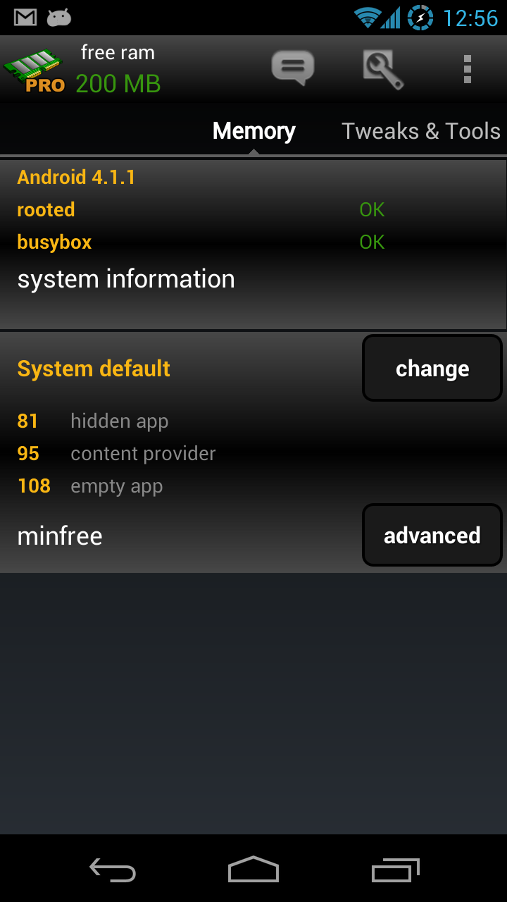
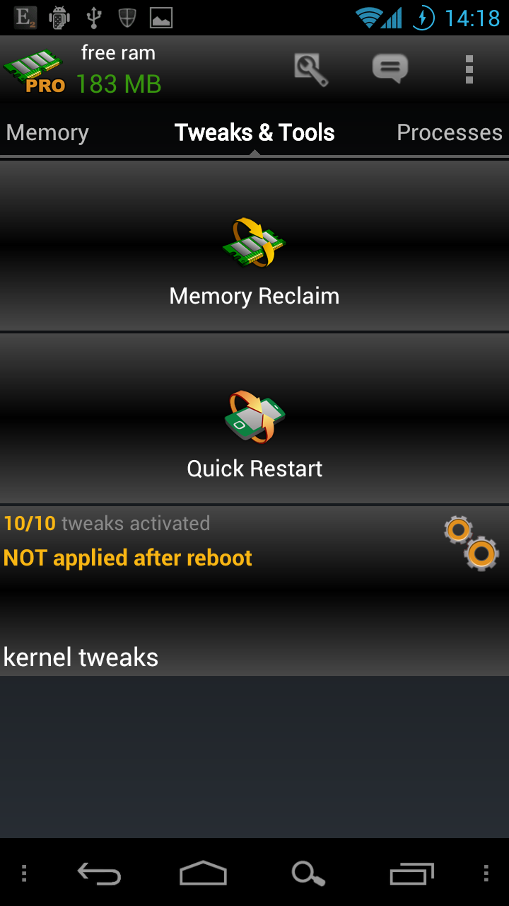
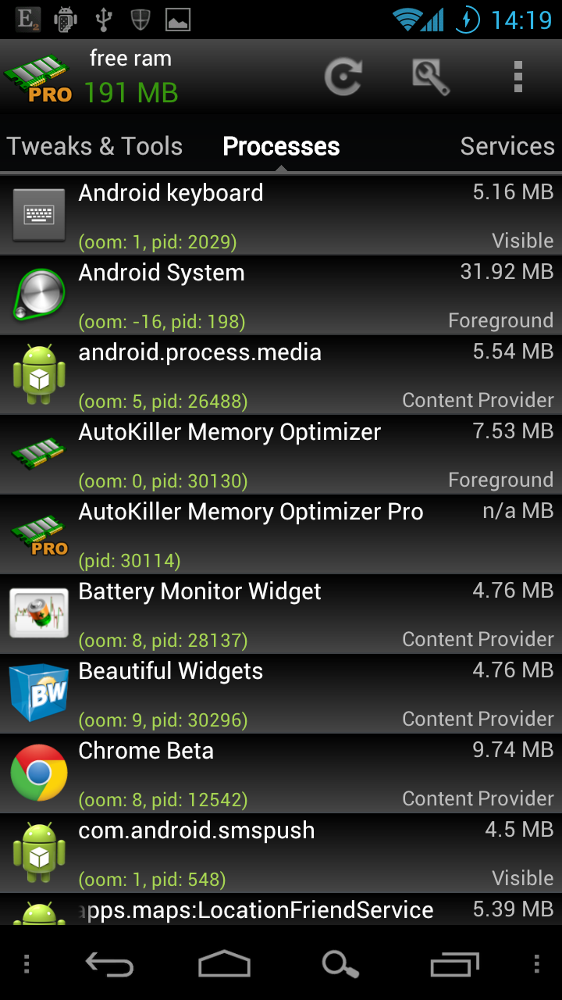
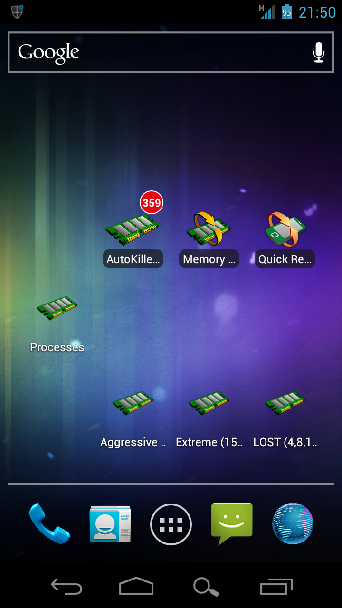
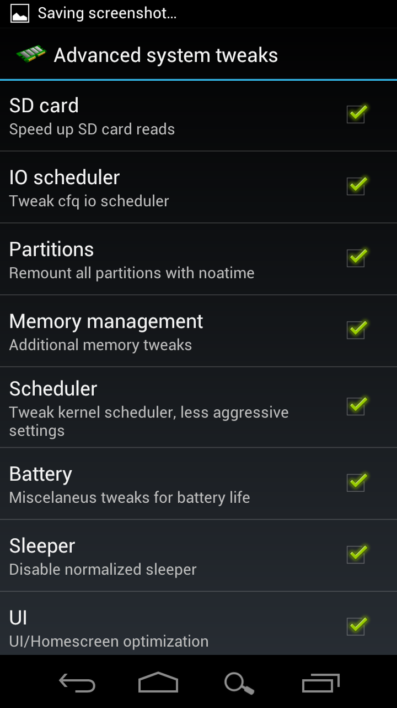
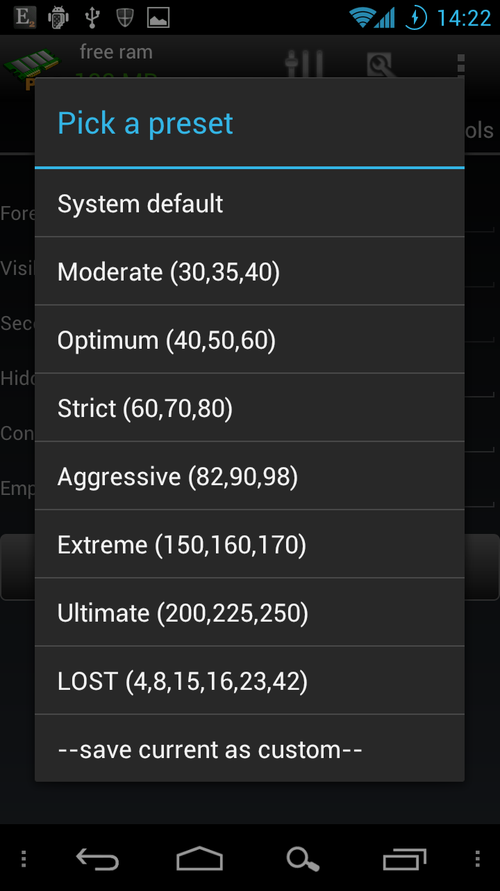
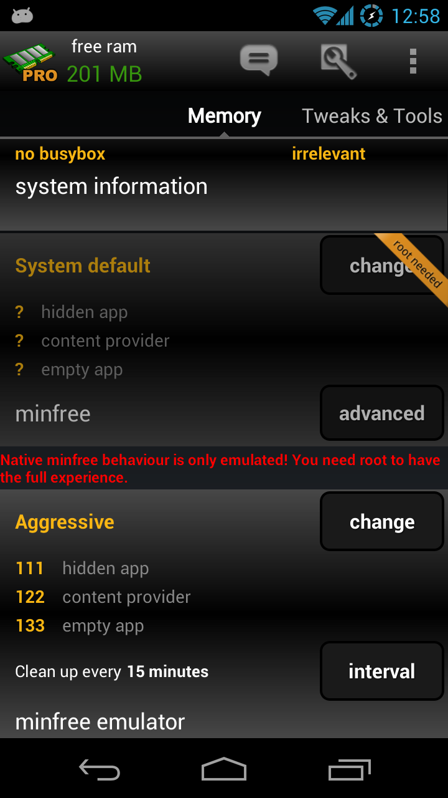
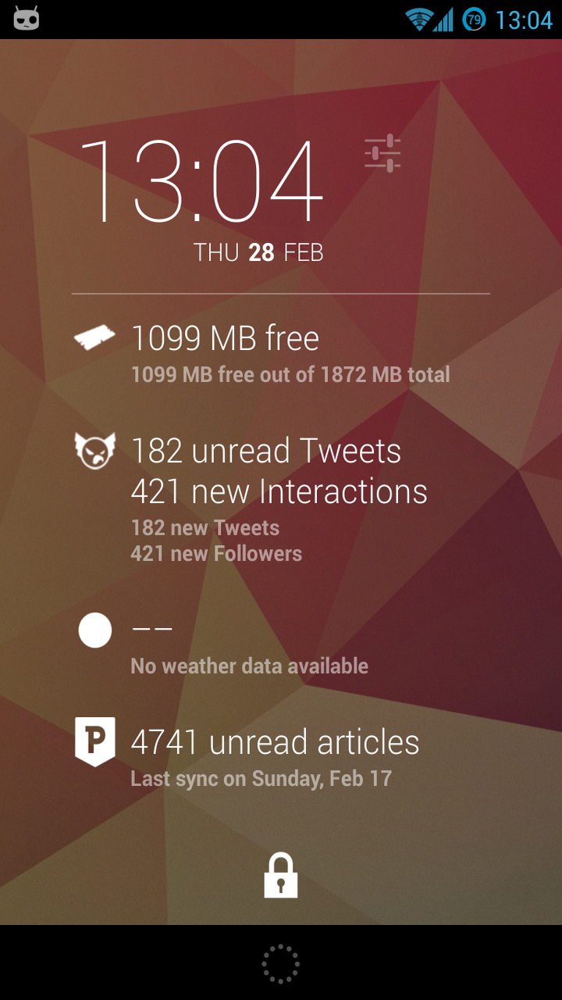
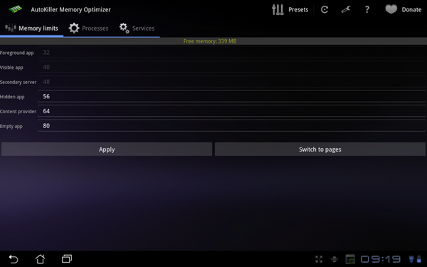

# Introduction

## AutoKiller Memory Optimizer

 

AutoKiller Memory Optimizer is designed to fine-tune android system's inner memory manager routines to keep your device fast and smooth. It also features a full-powered process manager which lets you control your whole system. If you want to know what it does and how it works you shall read about [details](autokiller/details.html "theory"), [process manager](autokiller/procman.html "process manager") and check the [faq](autokiller/faq.html "f.a.q.").

Features:

-   process manager
-   settings reapply on boot
-   alternate preset while screen is turned off (donator only feature)
-   simple/advanced mode
-   presets
-   shortcuts to presets
-   pages/mb views
-   statistics

!!! quote "Paul"
    Perfect on a rooted Nexus ! Works well and great widgets !

!!! quote "Mark"
    Makes my cyanogen modded G1 fly.

!!! quote "Michael"
    Saweeeeeet, makes my hero scream like a Jason Vorhees victim.

!!! quote "Super Jamie"
    Excellent! Why bother with a manual select task killer when this does it better.

## Winner of application of the year award -- (iPhone vs Android contest by Nav N Go)

 
 
 
 
 
 
 
 

## Go PRO

If you like my work please consider buying the PRO version, this will support further development.

