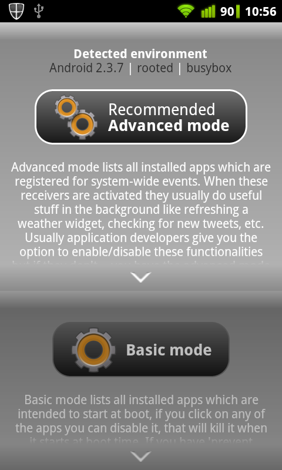
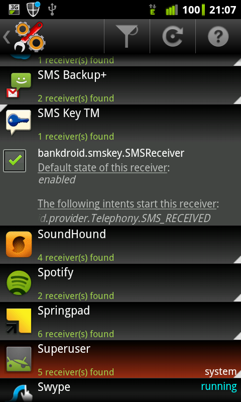

# Introduction

## Autorun Manager

Autorun Manager (formerly Autorun Killer) lets you decide what apps you want to let automatically start up. It sports two modes:
Basic mode lets you decide which startup apps should be killed right after they start during system boot process.
Applications are usually autostarting because of a reason, so only disable one if you know exactly what it is doing and you definitely don't need it.
Advanced mode lists all your applications which are registered for system wide events (aka. [intents](https://developer.android.com/intl/fr/reference/android/content/Intent.html) like an incoming call, low battery or boot finished) and gives you the control to enable or disable these -so called- receivers.
Using this mode recommends above average knowledge about how your device works. **Please be very careful.**
If you encounter errors with your disabled apps please re-enable them.

 

## Go PRO

If you like my work please consider buying the PRO version, this will support further development.

