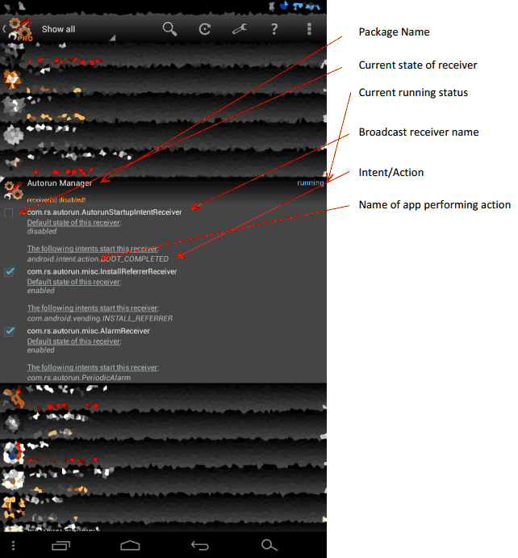

# User Guide

A dear user of Autorun Manager VivEk wrote a user guide based on a user's perspective. He approved me to publish it here:

## Autorun Manager

This is an app for android OS developed by Mobiwia AndRS studio. As the name indicates this app is used to prevent apps from spawning automatically that keeps on running at background eating up resources resulting in overall reduced performance of android device. This app doesn’t boost the speed of your device but actually assures that the user gets what device is really capable of. As many of us are familiar to Microsoft Windows operating system, whenever we install a new application in windows we tend to use windows start-up manager or any other third party app to disable unnecessary start-ups which increases booting speed of windows. Similarly we can improve the performance of our android device. The Android OS works in a very different way than windows, so before we directly start disabling start-ups on android we need to know how Android OS works so that we can take the full benefit of Autorun Manager app else we will just end up in frustration and writing horrible review for developer. I am writing Android OS guide from the perspective of using Autorun Manager app so that you can understand each and every function of this app.

## So what exactly we need to improve?

There are three main things which we need to consider in order to speed-up the overall performance, CPU usage, Memory usage and R/W speeds. For R/W speeds I recommend you to buy good performance SD cards because tweaking this in android would be digging too deep. Memory usage is smartly managed by Android OS itself and you can tweak that with AutoKiller Memory Optimizer. I do not recommend killing any task intentionally at all. This results in misbehaviour of OS or app adding a plus to frustration. Remaining this is CPU usage which we really need to consider. I would be discussing all about to improve overall CPU performance.

## Why this app is running?

In Android, apps get started automatically by using the broadcast receivers. A broadcast receiver has number of intents/actions. Whenever these actions are performed by OS/app the receiver gets triggered. The receiver then starts the app in the background and performs necessary actions in the background as decided by developer. Typical example can be, let’s say intent/action is boot completed under receiver boot. Whenever android OS finishes the boot process it broadcast the message that it has finished booting. The receivers who are able to listen to this action gets triggered and starts the app. So disabling this receiver would simply disable the app from listening to this broadcast message. Remember, whether this receiver can be disabled safely is judged on basis of action/intents present in it instead of reading receiver names.

## Packages

There are basically two types of packages which can be classified further. The apps which are located at /system/app/ are known as system apps also known as pre-installed apps. Apps which are located at /data partition are known as user apps also known as downloaded apps. System apps are installed in internal memory which is fastest and some of this memory is shared with /data partition so that users can install their favourite apps. Newer phones come with huge internal storage, fact behind this is embedded SD card also known as internal SD card. SD cards have slower I/O speeds than internal system storage. Additional plugged in SD card would be called as external SD card. Apps located on SD card are less affected by broadcast receivers. However apps are still affected broadcast receivers which are on internal SD card, which is because internal SD card mounted before booting. Apps located on external SD cards are less affected by broadcast receivers because they are mounted after Android OS finishes booting. So a useful tip would be installing apps on external SD card. Such apps can be games, utility apps but not useful apps like mail or chat clients. However I still recommend you to disable unwanted receivers for these apps as well. Disabling broadcast receivers for system apps is recommended at all and can cause significant unexpected issues. But if you’re an advanced user I encourage you to play with these apps as well. Such system apps can be preloaded promotional apps, games or any other less useful app.

## First Launch of app

This app can be run in two modes Advanced mode and Basic mode. Basic mode is not recommended and is for total beginners and for those who doesn’t want to read this guide. Reason is, in basic mode the automatically starting app is killed as soon as it gets started. This scenario will make circumstances even worse who are running low performance devices. What technically happens, an apps starts automatically and Autoruns Manager app kills it. Lots of CPU cycles are wasted in this process. Some developers include functionality of re-spawning i.e. the app is started automatically after few seconds when it gets killed and pre-mentioned procedure keeps on going. Recommended is using advanced mode.  Above image explains each and everything detailed. Now you got idea of what thing is what, let’s get into what’s happening. As you can see there’s a package named Autorun Manager which is the app itself I’m using for explaining things. This release of package has three broadcast receivers. Each of these receivers has single intent/action present in it. Before we start disabling receivers, first try to understand the reason why this receiver is included with these actions and what functionality would be removed if I disable that receiver. First receiver is named as “com.rs.autorun.AutorunStartupIntentReceiver”. Remember receiver names are customized by developers so no decision can be made by just reading receiver name. It just helps in getting idea what kind of actions could be present in that receiver. This receiver has one action named “android.intent.action.BOOT\_COMPLETED”. The lower case letters are representing package name which is Android OS itself in this case while the upper case letters are representing action name. It is now clear in this case that when Android OS is finishing boot process it is broadcasting message that it has finished booting. The broadcast receiver listens this broadcasting and starts the app. Now before we disable try to guess which functionality might be disabled if I disable this broadcast receiver. Possible reasons can be, the basic mode won’t work because it requires the app itself to be in running condition to kill apps. Second receiver has intent named “com.android.vending.INSTALL\_REFERRER”. In this case package name is Google Play Store. When you install any package from Google Play Store it broadcasts the message and this receiver listens to it. Possible reasons could be collecting statistical data. Third receiver has intent named “com.rs.autorun.PeriodicAlarm”. In this case package name is Autorun Manager the app itself I’m using. The app itself broadcasts message and receivers listens to it and perform necessary actions. Figuring out such receivers is very hard because we’ve no idea what’s on developer’s mind. Usually these receivers are vital parts of app. There is no need to disable such receivers because if the broadcasting app is not running then there is no triggering at all.

*--thank you VivEk*

