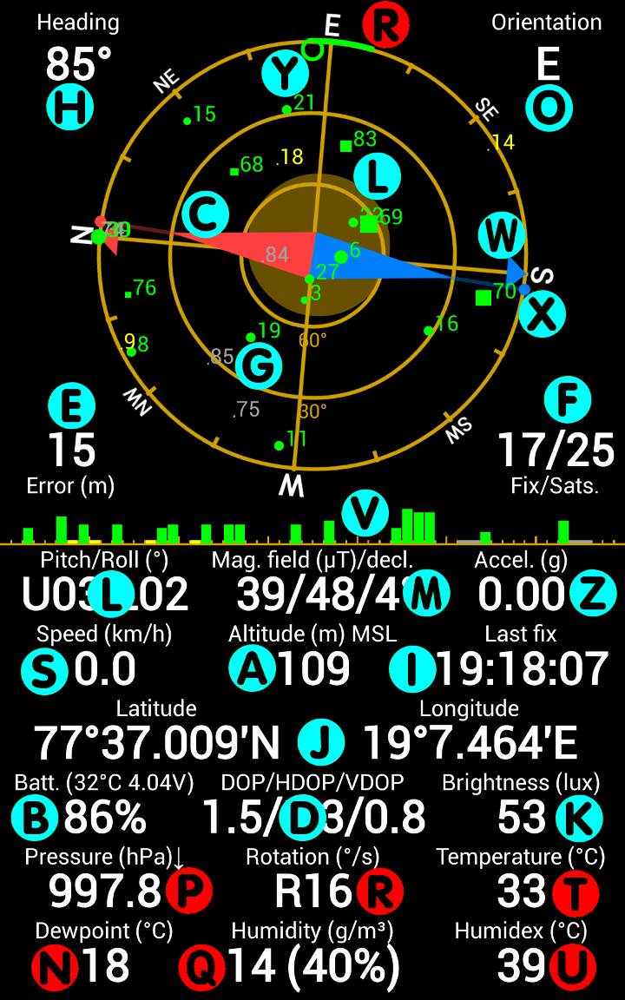
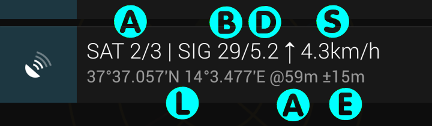
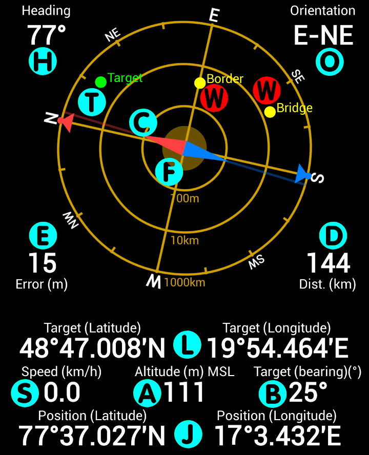
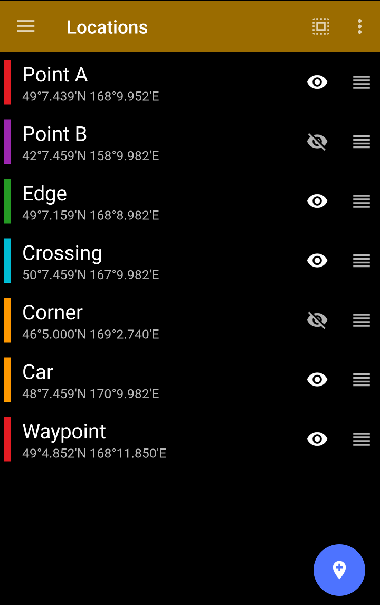
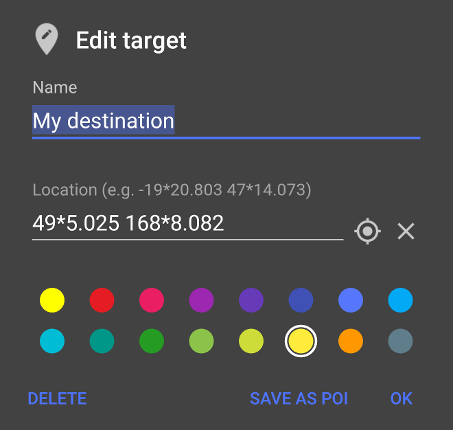
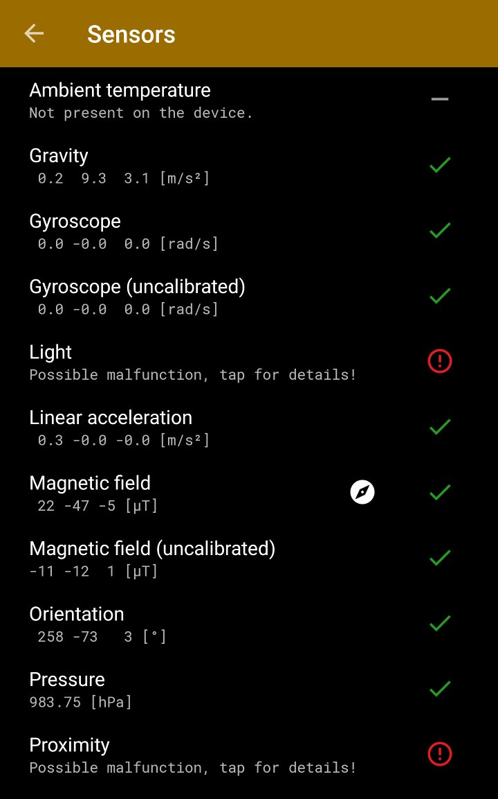
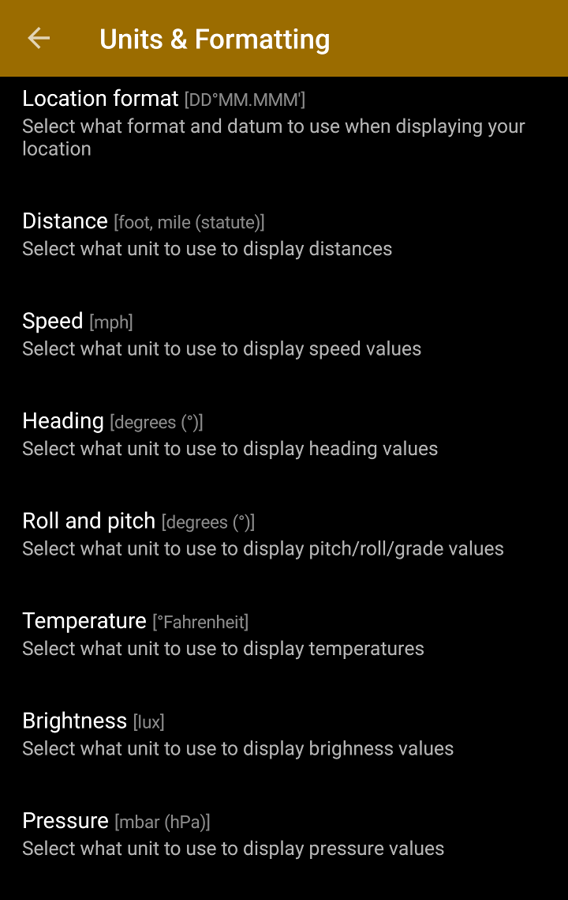

# User Guide

## Before you start 

If you have problems with the GPS receiver (no lock), 
or issues with the sensors (wrong compass orientation etc.), please read the [FAQ](faq.md). 
The FAQ contains a lot of useful information about possible problems, use cases etc.

## What does it do?

**GPS Status & Toolbox** is a simple program to show all the GPS and sensor data of 
your phone. It is designed to be simple, yet effective. It helps you to see what is 
happening while the GPS is trying to acquire your locations and can be used as a 
simple compass, as a leveling tool. It will measure the phone’s speed and acceleration, 
the brightness or the air pressure (if your phone has the necessary sensors.) The 
program also supports basic navigation functions that are useful when you are out 
in the wild. The app has four main screens plus it can display a system notification 
to show GPS data.

- **Status** - display for all your raw data
- **Radar** - for basic off-road navigation
- **Locations** - for your stored locations
- **Sensors** - for listing and testing all the sensors available in your device
- **Settings** - for customizing units, display properties

## Status screen

 

The screen has three main parts: The **sky grid (G)**, the **signal strength 
bar (V)** and the **instrument panels**.

The sky grid **(G)** shows the GPS satellites above you as the receiver in the 
phone detects them. GPS satellites (with IDs 1-32) are represented by disks. 
GLONASS satellites (with IDs r1-r25) are shown as rectangles, BEIDOU satellites 
(with IDs c1-c33) are shown as crosses (x) while GALILEO sats (with IDs e1-e35) 
are displayed as plus (+) signs. The size of the symbol depends on the signal 
strength received from that satellite. The color shows what data is available 
for that satellite and how it is currently used by the phone.

- green: satellite is used while determining the location
- yellow: all orbital data is available, but the satellite is not used
- blue: only rough orbital data (almanach) is available
- grey: orbital data is not available

Usually at least 4 satellites are required to have a lock. The more satellites are available 
the more accurate the position will be (to a certain limit. i.e. having 20 sats in a lock does 
not really increase the accuracy compared to 10). Certain phones may opt to use only a single 
constellation at a time and fall back to others if that constellation does not have enough 
visible satellites.) The order of preference is market dependent, however it is mostly GPS, 
then GLONASS and then BEIODU. As of the beginning of 2017 only a few phones support 
the GALILEO constellation. If you have problems getting a fix, please [read the FAQ](faq.md) 
for troubleshoothing tips.

The compass needle **(C)** in the center of the grid will show you the direction of the 
magnetic field as measured by your phone. (This may or may not be the actual magnetic north, 
depending on how much extra magnetic field is present in your environment. Magnetic anomalies 
are always present in buildings and vehicles so you should **NOT** expect your compass to 
work flawlessly in these environments.) The program automatically calculates the magnetic 
declination (the difference between magnetic and true north) and the absolute strength of 
the magnetic field at your current location **(M)**. If the measured field is stronger 
than the calculated you will see the needle grow while with weaker fields the needle will 
shrink. If there are no extra magnetic fields in your environment the needle should be roughly 
the same size as the inner circle of the sky grid. In addition to this, the magnetic compass 
in your phone reports the accuracy of the measurement. 

If the needle gets transparent (or you see a question mark appearing in the magnetic
field reading instrument) then the compass may need a recalibration (in the side navigation 
*Compass Calibration* menu). The recalibration 
can be done any time the app is running (i.e. you don't need to enter the 'Calibration' dialog, 
however that dialog displays the accuracy reported by the phone so you will get a bit better 
feedback.) You can recalibrate by either rotation your phone several times along its 3 axes 
(as instructed in the dialog), or by less scientifically, just simply holding your phone and 
waving it in an 8 pattern. You should test which method works best as it is also dependent on 
the actual firmware of the phone.

Magnetic compasses are inherently inaccurate. GPS can do a much better job determining your 
direction of movement. By default the sky grid aligns itself using the magnetic compass. 
Once you move faster than 5km/h a green arrow will appear showing your direction of movement 
and the sky grid will align using the much more accurate GPS heading data. The red/blue arrows 
**(W)** around the perimeter of the grid show the true north/south while the red/blue dots 
**(X)** show the magnetic north/south. The difference between the two direction is known as 
the magnetic declination **(M)**.

!!! tip 
    There is a small empty circle **(Y)** (can be turned off in Settings) that allows you to find the direction of any satellite. Just turn and tilt your phone until the circle covers a satellite symbol. Your phone will point towards the real satellite that is some 20000 km away from you. (This feature is not particularly useful, but it is extremely geeky!)

The grid also contains a moving amber circle (can be turned off in Settings). This can 
be used as a leveling tool **(L)** to find horizontal or vertical surfaces using your phone. 
You may need to calibrate the leveling tool before using it (in the side navigation menu).

In the **PRO** version, the rotation speed **(R)** of the phone is also displayed along the 
perimeter of the sky grid. The longer the green arcs, the faster the phone is rotating.

The signal strength bars **(V)** show the individual satellite signal strength values. 
The bar is divided into 4 parts displaying GPS, GLONASS, BEIDOU and GALILEO sats (left to right).

The rest of the screen displays numerical values derived from the phone’s sensors and GPS.

- Heading **(H)**: the absolute direction the phone is facing
- Orientation **(O)**: main cardinal points your phone is heading currently
- aGPS data age **(E)**: the age of the GPS assistance data used for speeding up the GPS locks.
- Error **(E)**: the accuracy of the actual location information.
- Number of satellites **(F)**: the number of satellites used for the actual fix and the total number of satellites visible for the GPS receiver (GPS+GLONASS/total.)
- Pitch and Roll **(L)**: the attitude of your phone.
- Magnetic field **(M)**: the three values represent the strength of measured magnetic field / the calculated strength of the field / magnetic declination (the difference between true and magnetic north). (Tip: the first slash will turn into a question mark if the phone detects that you have to recalibrate the phone’s magnetometer.)
- Acceleration **(Z)**: the measured linear acceleration of the phone.
- Speed **(S)**: the actual speed measured by the GPS.
- Altitude **(A)**: the current altitude relative to the Mean Sea Level (MSL) or the WGS84 geoid (configured in Settings).
- Last fix **(I)**: the GPS time of the last valide fix that is shown currently on the screen.
- Location (latitude/longitude) **(J)**: The acquired GPS location (format is configured in Settings).
- Battery info **(B)**: the remaining charge, battery voltage and temperature.
- DOP (dilution of precision) **(D)**: a value that represents how optimal the satellite constellation is. Smaller values represent better satellite arrangement. The total, horizontal and vertical component is also displayed.
- Brightness **(K)**: the measured light flux (if the phone supports it). The accuracy of this value is dependent on the quality of the brightness sensor.
- Pressure **(P)** \[**PRO**\]: atmospheric pressure measured by the phone sensor (if the phone supports it).
- Rotation speed **(R)** \[**PRO**\]: this is the direct readout from the phone’s gyroscope sensor (if the phone supports it).
- Ambient temperature **(T)** \[**PRO**\]: the temperature around the phone (available only on Galaxy S4 and Note3).
- Dewpoint **(N)** \[**PRO**\]: the temperature below which water vapor will start condense (available only on Galaxy S4 and Note3).
- Humidity **(Q)** \[**PRO**\]: the amount of water vapor in the air (available only on Galaxy S4 and Note3).
- Humidex **(U)** \[**PRO**\]: an index that shows how hot the weather feels to the average person (available only on Galaxy S4 and Note3).

## Status Notification

By default, the application will show the most important GPS data whenever the 
GPS is accesses, even if other apps accessing it.

If you do not need the notification feature, you can turn it off in 
*Settings / Background Behavior / GPS Status in Notification -&gt; Never*.

- **(A)** Number of satellites: GPS in use \[+ GLONASS in use\] / Total visible
- **(B)** Average signal to noise ratio (0-40dB)
- **(D)** Dilution of Precision (smaller is better)
- **(S)** Speed
- **(L)** Current location
- **(A)** Altitude
- **(E)** Position accuracy

Tapping on the notification item will open GPS Status. This is an easy way to open the app from any other application that is using the GPS. Wait for the lock in GPS Status then press the back button to immediately return to the original application without loosing the lock. The notification have some extra actions that allows you to dismiss it temporarily, re-download the aGPS data, or mark your current position for future use.

!!! note
    This feature uses little to no battery as the notification is updated only when it is shown. The display routine does NOT access or keep the GPS open. It just intercepts the location data that is requested by the other application. GPS Status never keeps the GPS open if it was put into the background.

## Radar screen

Radar screen can store a single way point (Edit/Mark action button) and allows you to navigate back using the GPS and the internal compass in your phone. Just move towards the point and use the screen as it would be a "radar". The radar screen will display heading and distance to the target point. It is possible to enter or edit the target coordinates and you can also share your current location by using the Share action. The marked point can be displayed in any of the supported mapping applications. Additional waypoints can be displayed on the radar if you change the given waypoint's visibility on the Locations screen (tap the eye icon).

!!! tip
    Long tapping the Edit/Mark mark location button will immediately store the current location as a target (and will override the previous target without displaying a dialog). This is useful to drop a breadcrumb so you will be able to get back here later (i.e. after parking a car etc.)

- Heading **(H)**: the absolute direction the phone is facing.
- Orientation **(O)**: main cardinal points your phone is heading currently.
- Compass needle **(C)**: magnetic compass needle.
- Error **(E)**: the accuracy of the actual location information.
- Distance **(D)** : distance to the current target point.
- Accuracy range **(F)** : the current position accuracy shown as a range around the actual position.
- Target (latitude/longitude) **(L)**: the coordinates of the currently selected target point.
- Speed **(S)**: the actual speed.
- Altitude **(A)**: the current altitude relative to the Mean Sea Level (MSL) or the WGS84 geoid (configured in Settings).
- Bearing **(V)** : Bearing to the target point
- Location (latitude/longitude) **(J)**: the current location.
- Target point **(T)** : the target point shown on the radar grid relative to the current position.
- Additional waypoints **(W)** \[**PRO**\]: additional waypoints selected on the *Locations* screen.

## Locations

 

This screen allows you to store 3 waypoints persistently (unlimited in PRO version). 
Long tapping an item puts the list into edit mode where you can select more items or 
reorder them. After selecting items you can export them by choosing the "Export" 
item the action bar. Importing in KML, CSV and GPX format is also available here.
 

Waypoints can be added either from the Radar screen by opening the Edit target 
dialog and choosing "Save as POI" or by tapping the 'Add location' button on the 
'Locations' screen. You can assign a color to the point. You can edit an item by 
tapping on it. The Edit dialog allows you to select the given point as a target 
on the Radar screen.

## Sensor Diagnostics

This screen can be used for troubleshooting phone sensor issues. It displays 
all possible sensors and marks the ones that are actually supported by your 
device. It also tries to acquire some values from the sensors to see 
whether they are working correctly. If you see error marks on the list, 
tap the entry and follow the instruction to test the given sensors properly.

## Settings

Display units, UI language, sensor filtering, color scheme, message used for sharing 
your location and a bunch of other options can be configured to customize the 
application. Note that GPS Status is using the WGS84 datum whenever coordinates are used.

[Spanish PDF version](GPSStatusProES.pdf)